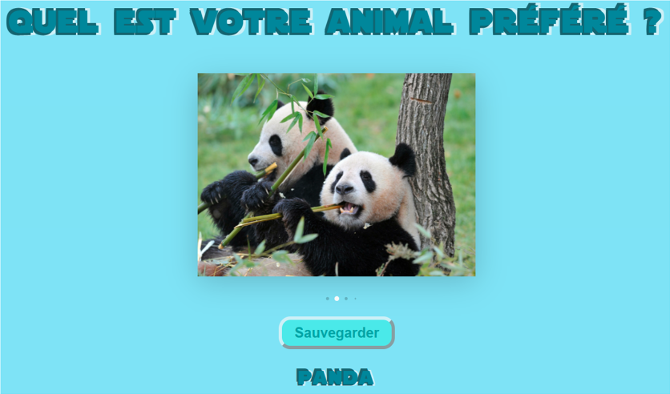
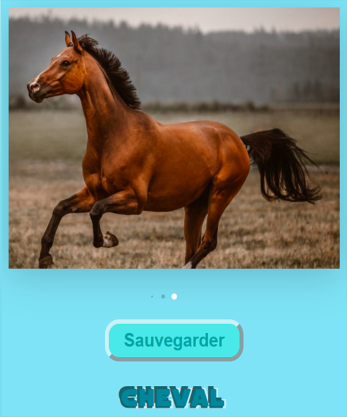

# TPCloudAnimal

## Lancement

Les étapes : 
- Télécharger le fichier ZIP, l'extraire.
- Se placer dans le dossier où il y a les sources et le Dockerfile et build l'image docker : docker build -t tpcloud/python-favanimal:1.0 .
- Créer un container à partir de l'image : docker run -ti -p 8080:80 tpcloud/python-favanimal:1.0
- Se rendre sur l'addresse internet : localhost:8080

## Description

Pour ce mini projet, j'ai utilisé flask en python pour pouvoir écrire dans un fichier json.

Pour décrire basiquement le projet, on lis un fichier JSON qui contient 2 paramètres : 
- possibleAnimals : tableau des animaux possibles en lien avec les images, l'ordre de ce tableau est 
important et correspond au image du code HTML
- favoriteAnimal : le nom de l'animal préféré de l'utilisateur

Lorsque l'utilisateur va sur l'url : localhost:8080, il se trouve devant une page web
lui demandant de choisir son animal préféré, il peux alors faire glisser les images pour choisir son
animal préféré parmi la liste prédéfini suivante : lion, panda, aigle, chien, dauphin, chat et cheval.

Une fois sur celui-ci on peut sauvegarder son choix en cliquant sur sauvegarder

La donnée est sauvegardée, si l'utilisateur recharge la page, il tombera en premier lieu sur son choix préféré
peu importe qu'il recharge la page sur une autre image que celle de son choix préféré.

Concernant la persistance des données, lorsque le container de l'image est supprimé, et que l'on
créer un nouveau container à partir de celle-ci, le choix de l'utilisateur est bien sauvegardé et on le 
remarque facilement par le fait qu'on sera redirigé vers le choix favoris lors du chargement de la page.

Par exemple dans le cas-ci dessous, lorsque l'on choisis de sauvegarder "cheval" en tant qu'animal favoris, lorsque l'on recharge la page, on tombera sur l'image du cheval en premier.

